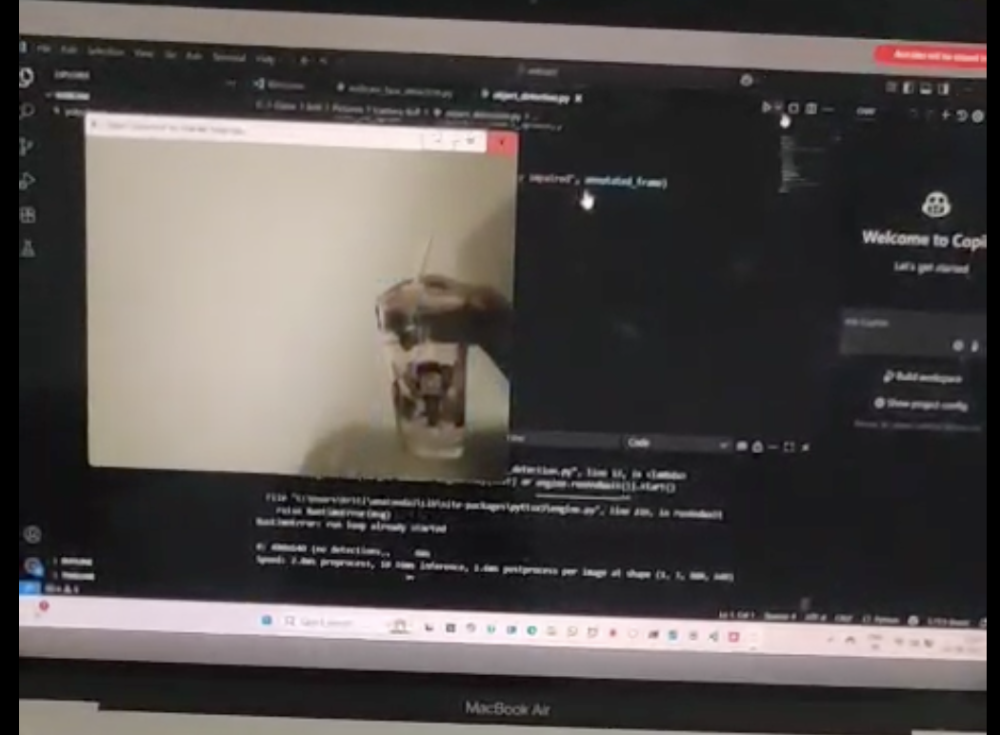
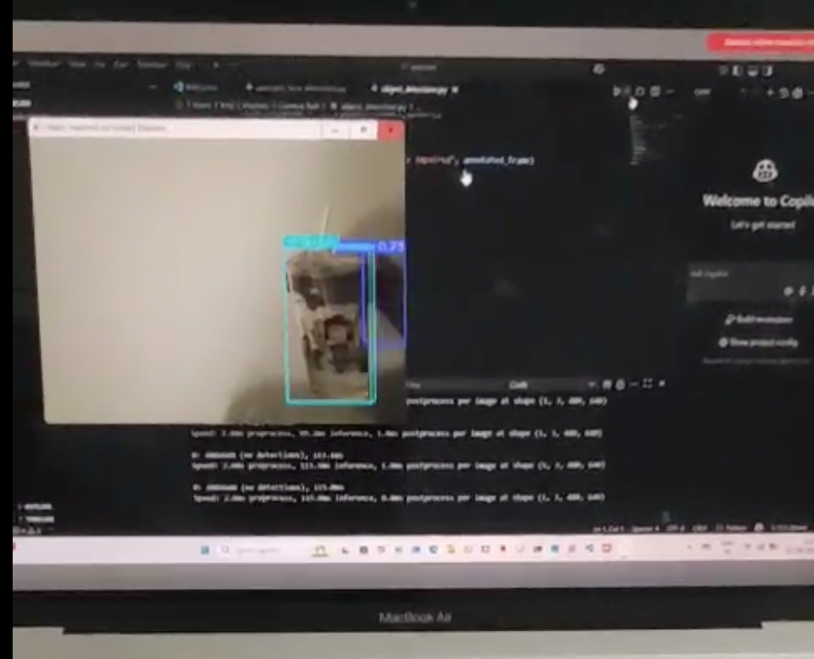

# Computer Vision – Real-Time Face & Object Detection

A computer vision application that combines **OpenCV-based face detection** with **YOLOv8-based object detection** to perform real-time visual analysis from live camera input.

The project demonstrates practical implementation of computer vision techniques for detecting visual entities from video streams and drawing detection results directly on live frames.

---

## 🚀 Project Overview

This project is designed to explore and implement real-time computer vision using Python.

It contains two independent detection modules:

- **Face Detection** – Detects human faces in a live webcam stream using OpenCV's pre-trained Haar Cascade classifier.
- **Object Detection** – Uses a YOLOv8 model to identify objects from video/camera input and perform real-time inference.

The project focuses on converting live visual input into meaningful detection results with minimal processing delay.

---

## ✨ Key Features

- 🎥 Real-time webcam/video stream processing
- 👤 Face detection using OpenCV Haar Cascade
- 🎯 Object detection using YOLOv8
- 🖼️ Bounding-box visualization for detected entities
- ⚡ Real-time frame-by-frame inference
- 🧩 Modular Python scripts for separate detection tasks
- 🤖 Pre-trained YOLOv8 model integration
- 🔧 Simple and extensible project structure

---

## 🛠️ Technologies Used

| Technology | Purpose |
|---|---|
| **Python** | Core programming language |
| **OpenCV** | Image processing, webcam capture and face detection |
| **YOLOv8** | Real-time object detection |
| **Ultralytics** | YOLO model/inference framework |
| **Haar Cascade** | Pre-trained face detection classifier |

---

## 📁 Project Structure

```text
CV-Detection-Project/
│
├── object_detection2.py
│   └── YOLOv8-based object detection
│
├── webcam_face_detection2.py
│   └── Real-time webcam face detection using OpenCV
│
├── yolov8n2.pt
│   └── Pre-trained YOLOv8 model weights
│
└── README.md
    └── Project documentation
```

---

## 🔍 Module 1 — Face Detection

The `webcam_face_detection2.py` module uses OpenCV's pre-trained Haar Cascade classifier to detect faces from the webcam feed.

### Processing Flow

```text
Webcam Input
     ↓
Capture Video Frame
     ↓
Convert Frame to Grayscale
     ↓
Haar Cascade Face Detection
     ↓
Detect Face Coordinates
     ↓
Draw Bounding Boxes
     ↓
Display Real-Time Output
```

The implementation uses:

```python
cv2.CascadeClassifier(
    cv2.data.haarcascades +
    'haarcascade_frontalface_default.xml'
)
```

This allows the project to use OpenCV's bundled frontal-face detection model without manually storing the XML classifier in the repository.

---

## 🎯 Module 2 — YOLOv8 Object Detection

The `object_detection2.py` module uses the included `yolov8n2.pt` model to perform object detection.

### Processing Flow

```text
Video / Webcam Input
        ↓
Frame Acquisition
        ↓
YOLOv8 Inference
        ↓
Object Classification
        ↓
Bounding Boxes + Labels
        ↓
Real-Time Visualization
```

YOLOv8 is well suited for this project because it provides efficient object detection suitable for real-time applications.

---

## ⚙️ Installation

### 1. Clone the repository

```bash
git clone https://github.com/kashish-Singh25/CV-Detection-Project.git
cd CV-Detection-Project
```

### 2. Create a virtual environment

```bash
python3 -m venv venv
```

Activate it on macOS/Linux:

```bash
source venv/bin/activate
```

On Windows:

```bash
venv\Scripts\activate
```

### 3. Install dependencies

```bash
pip install opencv-python ultralytics
```

---

## ▶️ Running the Project

### Face Detection

```bash
python webcam_face_detection2.py
```

The webcam window will open and detected faces will be highlighted with bounding boxes.

To exit the webcam window, press:

```text
q
```

### Object Detection

```bash
python object_detection2.py
```

The YOLOv8 model will process the input stream and display detected objects with their corresponding detection results.

---

## 📸 Project Screenshot






## 🧠 Computer Vision Pipeline

The overall architecture can be summarized as:

```text
                 ┌──────────────────┐
                 │   Camera / Video │
                 └────────┬─────────┘
                          │
                          ▼
                 ┌──────────────────┐
                 │  Frame Capture   │
                 └────────┬─────────┘
                          │
                 ┌────────┴────────┐
                 │                 │
                 ▼                 ▼
        ┌─────────────────┐  ┌─────────────────┐
        │ OpenCV Face     │  │ YOLOv8 Object   │
        │ Detection       │  │ Detection       │
        └────────┬────────┘  └────────┬────────┘
                 │                    │
                 └─────────┬──────────┘
                           ▼
                 ┌──────────────────┐
                 │ Detection Output │
                 │ + Bounding Boxes │
                 └──────────────────┘
```

---

## 📌 Use Cases

The techniques demonstrated in this project can be extended to applications such as:

- Smart surveillance systems
- People and object monitoring
- Security and access-control prototypes
- Camera-based automation
- Intelligent video analytics
- Human-computer interaction
- Computer vision research and experimentation

---

## 🔮 Future Enhancements

Potential improvements include:

- Real-time object tracking
- Face recognition and identity verification
- Confidence-score visualization
- Multiple camera support
- FPS and performance monitoring
- Detection result logging
- Web-based visualization dashboard
- Custom-trained YOLO models
- GPU acceleration for higher inference performance

---

## 📊 Learning Outcomes

Through this project, the following concepts are demonstrated:

- Real-time image processing
- Computer vision fundamentals
- Webcam and video-stream handling
- Face detection using classical computer vision
- Deep-learning-based object detection
- YOLO model integration
- Bounding-box visualization
- Python-based modular project development

---

## 👩‍💻 Author

**Niharika**

Github: [@Niharika08hub](https://github.com/Niharika08hub)

**Kashish Singh**

GitHub: [@kashish-Singh25](https://github.com/kashish-Singh25)

---

## 📄 License

This project is intended for educational, learning, and portfolio purposes.
